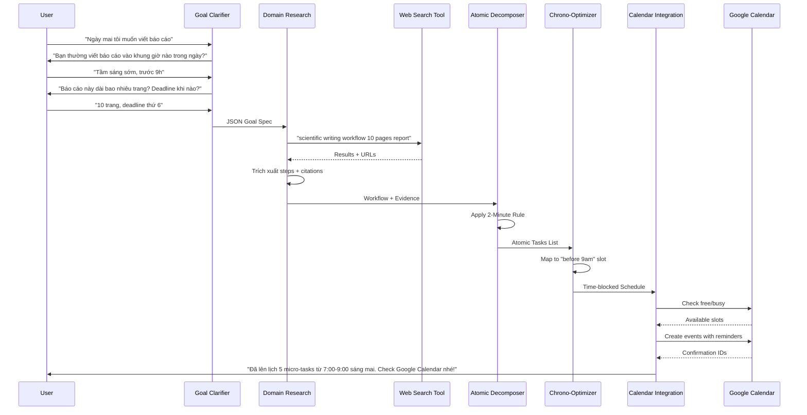

# DEVELOPMENT-DOC.md

## 1. Tổng quan dự án

**Tên dự án**: Atomic Task Planner (ATP)  
**Mô tả**: Hệ thống Multi-Agent AI giúp người dùng trì hoãn chuyển đổi mục tiêu mơ hồ thành chuỗi hành động siêu nhỏ (Atomic Habits) có dẫn chứng khoa học và đồng bộ Google Calendar  
**Phiên bản**: 1.0 - MVP cho cuộc thi  

---

## 2. Kiến trúc hệ thống

### 2.1. Sơ đồ Agent Pipeline

```
[User Input] 
    ↓
[Goal Clarifier Agent] ←→ [Memory/Context Store]
    ↓ (Goal Spec + Personal Context)
[Domain Research Agent] ←→ [Web Search Tool]
    ↓ (Raw Task List + Citations)
[Atomic Decomposer Agent] 
    ↓ (Atomic Tasks with Psychology Triggers)
[Chrono-Optimizer Agent]
    ↓ (Time-blocked Schedule)
[Calendar Integration Agent] ←→ [Google Calendar API]
    ↓
[Final Output + Confirmation]
```

### 2.2. Danh sách Agent (5 Agent)

| Agent ID | Tên | Mục tiêu chính | Tools |
|---------|-----|----------------|-------|
| A1 | Goal Clarifier | Hội thoại đa lượt để làm rõ mục tiêu và thu thập context cá nhân | None (LLM only) |
| A2 | Domain Research | Tìm kiếm workflow chuẩn và best practices có trích dẫn | Web Search (Tavily/Serper) |
| A3 | Atomic Decomposer | Áp dụng Atomic Habits để chia nhỏ tasks | None (LLM + Rules) |
| A4 | Chrono-Optimizer | Gán thời gian sinh học phù hợp | Time Analysis Algorithm |
| A5 | Calendar Integration | Ghi lịch và thiết lập nhắc nhở | Google Calendar API |

---

## 3. Chi tiết kỹ thuật từng Agent

### 3.1. Agent A1: Goal Clarifier

**Prompt System Behavior**:
```
Bạn là một coach thân thiện, kiên nhẫn. Nhiệm vụ của bạn là KHÔNG ĐƯỢC đưa ra kế hoạch ngay lập tức. 
Thay vào đó, bạn phải hỏi lại user cho đến khi đủ thông tin sau:

THÔNG TIN BẮT BUỘC THU THẬP:
1. Mục tiêu cụ thể (Output mong muốn là gì?)
2. Deadline hoặc khung thời gian cứng
3. Ngữ cảnh cá nhân:
   - Đây là lần đầu họ làm việc này hay đã quen?
   - Rào cản hiện tại (vì sao họ chưa bắt đầu?)
   - Mức năng lượng dự kiến ngày mai (High/Medium/Low)
4. Thói quen sinh học:
   - Giờ ngủ/dậy thường lệ
   - Khung giờ vàng (peak performance) - PHẢI HỎI RÕ
   - Các thói quen hiện có có thể stack (ví dụ: "sau khi đánh răng", "trước khi ăn trưa")

LUẬT HỘI THOẠI:
- Chỉ hỏi 1-2 câu mỗi lượt để không overwhelm user
- Nếu user trả lời mơ hồ, hỏi lại theo cách cụ thể hơn
- Khi đủ thông tin, output JSON theo schema bên dưới và kết thúc hội thoại bằng câu: "Mình đã hiểu rõ. Để mình nghiên cứu cách tối ưu nhất cho bạn nhé!"
```

**Output Schema**:
```json
{
  "clarified_goal": "string (SMART format)",
  "user_context": {
    "experience_level": "beginner|intermediate|advanced",
    "estimated_energy_tomorrow": "high|medium|low",
    "peak_hours": ["08:00-10:00", "15:00-17:00"],
    "current_habits_for_stack": ["wake_up", "coffee", "lunch"],
    "constraints": ["deadline_x", "limited_time"],
    "procrastination_triggers": ["perfectionism", "too_big", "unclear"]
  },
  "conversation_history": [...]
}
```

### 3.2. Agent A2: Domain Research

**Yêu cầu bắt buộc**:
- PHẢI sử dụng Web Search Tool (không được dùng kiến thức internal)
- Mỗi task/sub-task đều phải có `evidence_url` và `source_summary`
- Tìm kiếm các từ khóa pattern: "best workflow for [goal]", "scientific approach to [task]", "[expert] method for [activity]"

**Prompt System**:
```
Bạn là chuyên gia nghiên cứu. Dựa vào mục tiêu đã làm rõ, hãy tìm kiếm trên web:
1. Các bước thực hiện chuẩn (industry standard workflow)
2. Thời gian trung bình cho từng bước
3. Các lỗi thường gặp và cách tránh
4. Lợi ích khoa học/psychology của việc chia nhỏ task này

QUY TẮC TRÍCH DẪN:
- Chỉ dùng nguồn có độ tin cậy cao (research papers, healthline, productivity blogs nổi tiếng, books)
- Mỗi recommendation phải kèm URL và tóm tắt 1 câu tại sao nguồn này đáng tin
- Nếu có conflicting information giữa các nguồn, ưu tiên nguồn khoa học hoặc có citations nhiều hơn
```

**Output Schema**:
```json
{
  "domain": "string",
  "standard_workflow": [
    {
      "step_name": "string",
      "description": "string",
      "avg_duration_minutes": number,
      "complexity": "high|medium|low",
      "evidence": {
        "source_url": "https://...",
        "summary": "string (giải thích tại sao bước này cần thiết)",
        "authority": "string (tên tác giả/cơ quan)"
      }
    }
  ],
  "common_pitfalls": ["string"],
  "optimal_conditions": {
    "time_of_day": "string",
    "prerequisites": ["string"]
  }
}
```

### 3.3. Agent A3: Atomic Decomposer

**Core Logic**: Áp dụng 4 quy luật từ Atomic Habits (James Clear)
1. **Make it Obvious**: Mỗi task phải có trigger rõ ràng (time/location/previous action)
2. **Make it Easy**: 2-Minute Rule (task phải hoàn thành trong ≤2 phút hoặc là điểm bắt đầu)
3. **Make it Attractive**: Temptation Bundling (nếu applicable)
4. **Make it Satisfying**: Immediate reward/satisfaction

**Input**: Output từ A2 + Context từ A1  
**Output**:
```json
{
  "atomic_tasks": [
    {
      "id": "task_001",
      "name": "string (bắt đầu bằng động từ, cụ thể)",
      "duration_minutes": number (≤2 hoặc 5-10 cho deep work),
      "trigger": {
        "type": "time|location|preceding_event",
        "description": "Sau khi uống cà phê xong hoặc Lúc 8:00 tại bàn làm việc"
      },
      "atomic_habit_principle": "make_it_obvious|make_it_easy|make_it_attractive|make_it_satisfying",
      "psychology_reasoning": "string (giải thích tại sao chia nhỏ như này giúp tránh procrastination)",
      "evidence_from_research": "string (trích dẫn từ A2, ví dụ: 'Theo nghiên cứu tại URL_X, việc bắt đầu bằng 2 phút giúp giảm 47% khả năng trì hoãn')",
      "parent_step": "string (mapping với step trong A2)"
    }
  ],
  "habit_stack_chain": "string (mô tả chuỗi: Sau A thì B, Sau B thì C...)"
}
```

### 3.4. Agent A4: Chrono-Optimizer

**Algorithm**:
```python
# Pseudo-code logic
if user_context.energy == "high":
    assign_deep_work_to_peak_hours()
else:
    distribute_evenly_with_more_breaks()

if task.complexity == "high":
    assign_to_peak_hours()
    duration = 25-50 phút (Pomodoro)
else:
    fill_gaps_between_meetings()
    duration = 2-10 phút (Atomic)
```

**Output**:
```json
{
  "schedule": [
    {
      "task_id": "ref to A3",
      "start_time": "ISO 8601",
      "end_time": "ISO 8601",
      "rationale": "string (giải thích tại sao chọn giờ này: 'Peak performance window', 'Post-coffee high', etc.)",
      "backup_slot": "ISO 8601 (nếu task này bị delay)"
    }
  ],
  "buffer_time_included": true,
  "chronotype_match_score": "85%"
}
```

### 3.5. Agent A5: Calendar Integration

**API Requirements**:
- Google Calendar API v3
- OAuth 2.0 scope: `https://www.googleapis.com/auth/calendar.events`
- Tạo events với `reminders` (popup và email)

**Logic xử lý**:
```json
{
  "calendar_events": [
    {
      "summary": "[ATP] {task_name}",
      "description": "{psychology_reasoning}\n\nLý do khoa học: {evidence_from_research}\n\n(Nếu không muốn làm: Chỉ cần mở laptop và làm 2 phút thôi)",
      "start": {"dateTime": "...", "timeZone": "Asia/Ho_Chi_Minh"},
      "end": {"dateTime": "...", "timeZone": "Asia/Ho_Chi_Minh"},
      "reminders": {
        "useDefault": false,
        "overrides": [
          {"method": "popup", "minutes": 10},
          {"method": "email", "minutes": 60}
        ]
      },
      "colorId": "number (màu xanh lá cho easy tasks, đỏ cho deep work)",
      "extendedProperties": {
        "private": {
          "atomicTaskId": "task_001",
          "parentGoal": "clarified_goal",
          "isAtomic": "true"
        }
      }
    }
  ]
}
```

**Xử lý lỗi**:
- Nếu slot đã bị trùng lịch: Tìm slot trống gần nhất (±30 phút) và suggest cho user confirm
- Nếu API fail: Lưu vào local DB và retry sau 5 phút

---

## 4. Tools & Integrations

### 4.1. Web Search Tool
- **Đề xuất**: Tavily API hoặc Serper.dev (Google Search API)
- **Parameters**: 
  - `query`: Tự động generate từ clarified_goal
  - `include_domains`: ["verywellmind.com", "healthline.com", "jamesclear.com", "ncbi.nlm.nih.gov", "todoist.com", "lifehacker.com"]
  - `max_results`: 5
  - `search_depth`: "advanced"

### 4.2. Google Calendar API
- **Setup**: OAuth consent screen với redirect URI cục bộ (dev) hoặc production URL
- **Rate Limiting**: Max 500 requests/100 seconds/user
- **Quyền cần thiết**: 
  - Xem lịch (để check conflicts)
  - Tạo/sửa events
  - (Optional) Xem free/busy time

---

## 5. Luồng dữ liệu chi tiết (Sequence Diagram)



---

## 6. Yêu cầu Output cuối cùng cho User

Khi hoàn thành, hệ thống phải gửi cho user:

```markdown
## 🎯 Kế hoạch ngày mai: [Tên mục tiêu]

**Context của bạn**: [Tóm tắt ngắn energy level, peak hours]

### 📋 Chuỗi hành động (Atomic Tasks):

**7:00 - 7:02** | Mở laptop & tạo file Word tên "Báo cáo_Q4"
- *Trigger*: Ngay sau khi đánh răng xong
- *Lý do*: Theo [James Clear](URL), hành động đầu tiên phải mất <2 phút để vượt qua inertia
- *Dẫn chứng*: "Nghiên cứu tại ĐH Stanford cho thấy 65% người trì hoãn bắt đầu được nếu task đầu dễ" [Link]

**7:05 - 7:30** | Viết outline 5 bullet points chính
- *Trigger*: Sau khi uống nước xong
- *Lý do*: [Research] Outline giúp giảm 40% thời gian viết (Nguồn: VeryWellMind)
...

### 📅 Đã đồng bộ Google Calendar:
✅ Đã tạo 5 sự kiện với nhắc nhở trước 10 phút
✅ Màu xanh lá: Task dễ (2 phút) | Màu đỏ: Deep work
✅ Ghi chú tâm lý học trong phần mô tả từng event

### 💡 Nếu bạn muốn bỏ cuộc:
Chỉ cần làm **task đầu tiên** (2 phút) rồi dừng lại. Đó cũng là chiến thắng!

---
*ATP System - Powered by Behavioral Science*
```

---

## 7. Edge Cases & Xử lý

| Tình huống | Xử lý |
|-----------|-------|
| User trả lời không rõ ràng sau 3 lượt hỏi | A1 tự động điền default value và thông báo: "Mình sẽ giả định bạn là beginner và làm buổi sáng nhé" |
| Web Search không tìm thấy kết quả | A2 fallback dùng general productivity principles + ghi chú "(Chưa có dẫn chứng cụ thể cho lĩnh vực này)" |
| Google Calendar trùng lịch | A4 tự động dịch chuyển ±30 phút, nếu vẫn trùng thì suggest ngày hôm sau |
| Task quá lớn (ví dụ: viết luận văn 100 trang) | A3 chia thành "Sprint" (3 ngày), mỗi ngày chỉ lên lịch 1-2 micro-tasks |
| User từ chối cấp quyền Calendar | A5 xuất file .ics để user tự import + hướng dẫn setup reminder trên điện thoại |

---

## 8. Tech Stack đề xuất cho Coding Agent

- **Framework**: LangChain/LangGraph (Python) hoặc CrewAI
- **LLM**: GPT-4 (Agent reasoning) + GPT-3.5 (Simple formatting)
- **State Management**: Redis hoặc in-memory dict (cho MVP)
- **APIs**: 
  - Tavily API (Web Search)
  - Google Calendar API Python Client
- **Data Validation**: Pydantic models cho tất cả schemas trên
- **Error Handling**: Tenacity (retry logic) cho API calls

---

## 9. Checklist trước khi demo

- [ ] A1 hỏi ít nhất 3 thông tin cá nhân (peak hour, experience, constraints)
- [ ] A2 trả về ít nhất 1 URL thật cho mỗi task chính
- [ ] A3 chia task đầu tiên đúng 2 phút theo 2-Minute Rule
- [ ] A4 gán đúng vào peak hours của user
- [ ] A5 tạo được event trên Google Calendar với reminder hoạt động
- [ ] Mỗi task trong calendar có ghi chú "Lý do" và "Nếu mệt thì chỉ cần..."

**MVP Scope**: Chỉ cần chạy được 1 flow end-to-end với 1 ví dụ (ví dụ: chạy bộ hoặc viết báo cáo) là đủ cho vòng thi.
