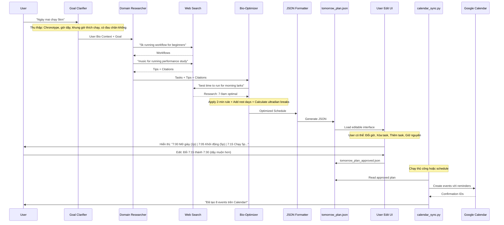

# DEVELOPMENT-DOC.md (Revised v2.0)

## 1. Tổng quan dự án

**Tên dự án**: Atomic Task Planner (ATP)  
**Mô tả**: Hệ thống Multi-Agent AI giúp người dùng trì hoãn chuyển đổi mục tiêu mơ hồ thành chuỗi hành động siêu nhỏ, có dẫn chứng khoa học, tối ưu sinh học, và cho phép chỉnh sửa trước khi đồng bộ lịch  
**Phiên bản**: 2.0 - MVP với User Edit Flow  

---

## 2. Kiến trúc hệ thống mới

### 2.1. Sơ đồ Agent Pipeline (4 Agents + 1 Standalone Tool)

```
[User Input] 
    ↓
[Agent 1: Goal Clarifier] ←→ [Context Memory]
    ↓ (Goal Spec + User Bio-Context)
[Agent 2: Domain Researcher] ←→ [Web Search Tool]
    ↓ (Detailed Tasks + Tips + Citations)
[Agent 3: Bio-Optimizer] ←→ [Web Search Tool]
    ↓ (Time-Scheduled Tasks + Rest Periods + Bio-Evidence)
[Agent 4: JSON Formatter] (No LLM - Pure Code)
    ↓ (Editable JSON Output)
[User Review/Edit Interface]
    ↓ (Approved JSON)
[Standalone: Calendar Sync Tool] ←→ [Google Calendar API]
    ↓ (Events Created)
```

### 2.2. Danh sách Agent

| Agent ID | Tên | Vai trò | Tools |
|---------|-----|---------|-------|
| A1 | **Goal Clarifier** | Thu thập mục tiêu và context sinh học người dùng | None (LLM Chat) |
| A2 | **Domain Researcher** | Research workflow + Tips có dẫn chứng | Web Search |
| A3 | **Bio-Optimizer** | Gán khung giờ sinh học + Rest time + Atomic chia nhỏ | Web Search |
| A4 | **JSON Formatter** | Tạo file JSON chuẩn hóa để user chỉnh sửa | Python Script |
| Standalone | **Calendar Sync** | (File riêng) Đọc JSON và ghi vào Google Calendar | GCal API |

---

## 3. Chi tiết kỹ thuật từng Agent

### 3.1. Agent A1: Goal Clarifier (Giữ nguyên)

**Nhiệm vụ**: Thu thập **sinh học chi tiết** của user để phục vụ Agent 3

**Thông tin bắt buộc**:
1. Mục tiêu cụ thể + Deadline
2. **Chronotype**: Morning Lark / Night Owl / Intermediate
3. **Giờ ngủ/thức dậy** thường lệ
4. **Meal timing**: Ăn sáng/trưa/tối thường lúc mấy giờ (để tránh xếp task vào lúc no/đói)
5. **Energy curve**: Giờ nào tỉnh táo nhất? Giờ nào buồn ngủ?
6. **Current obligations**: Có họp/có việc cố định nào ngày mai không?
7. **Physical/mental state**: Đang mệt/khoẻ? Có đau nhức không? (để A3 tính rest time)

**Output Schema**:
```json
{
  "clarified_goal": "string (SMART)",
  "user_bio_profile": {
    "chronotype": "lark|owl|intermediate",
    "sleep_time": "23:00",
    "wake_time": "07:00",
    "meal_times": {"breakfast": "07:30", "lunch": "12:00", "dinner": "19:00"},
    "peak_hours": ["08:00-10:00", "15:00-17:00"],
    "slump_hours": ["13:00-14:00"],
    "fixed_commitments": ["09:00-10:00: Team meeting"],
    "energy_tomorrow": "high|medium|low",
    "physical_constraints": ["knee pain", "back pain", ...]
  }
}
```

---

### 3.2. Agent A2: Domain Researcher (Nâng cấp)

**Nhiệm vụ**: Research **workflow** + **Pro Tips** có dẫn chứng

**Web Search Queries**:
- `"best workflow for [goal]"`
- `"scientific tips for [activity]"`
- `"optimal music for running performance study"`
- `"procrastination hacks for report writing research"`

**Yêu cầu Output**:
```json
{
  "domain": "string",
  "tasks": [
    {
      "task_id": "task_1",
      "name": "string",
      "description": "string",
      "estimated_duration": "ISO 8601 duration (PT30M)",
      "difficulty": "high|medium|low",
      "evidence": {
        "source_url": "https://...",
        "authority": "string",
        "summary": "Tại sao bước này cần thiết"
      }
    }
  ],
  "pro_tips": [
    {
      "tip_id": "tip_1",
      "content": "Nghe nhạc EDM 120-140 BPM khi chạy bộ giúp tăng hiệu suất 15%",
      "applies_to_task": "task_1",
      "evidence": {
        "source_url": "https://...",
        "study_summary": "Nghiên cứu năm 2023 tại Journal of Sports Medicine...",
        "applicability": "Đặc biệt hiệu quả với người mới bắt đầu"
      }
    }
  ],
  "warnings": ["Common pitfall 1", ...]
}
```

**Lưu ý**: Tips phải có **applies_to_task** để Agent 3 gắn vào đúng task cụ thể.

---

### 3.3. Agent A3: Bio-Optimizer (Mới - Gộp A3+A4 cũ)

**Nhiệm vụ**: 
1. Áp dụng **Atomic Habits** chia nhỏ tasks
2. **Research thời gian sinh học** phù hợp cho từng loại task (không tự nghĩ)
3. **Tính toán Rest Time** (break) bắt buộc giữa các task
4. Gán thời gian cụ thể

**Web Search cho Bio-Optimizer**:
- `"best time of day for creative work chronotype [lark/owl]"`
- `"optimal break duration between focus sessions"`
- `"exercise timing for [chronotype] energy"`
- `"Pomodoro technique rest intervals scientific study"`

**Logic xử lý**:

```python
# Quy tắc gán thời gian (có dẫn chứng từ Web Search)
if task.difficulty == "high":
    assign_to_peak_hours()
    duration = 25  # Pomodoro
    rest_after = 5  # Short break
elif task.difficulty == "medium":
    assign_to_should_hours()
    duration = 15
    rest_after = 3
else:  # low
    fill_gap_hours()
    duration = 2  # 2-minute rule
    rest_after = 0

# Thêm rest time bắt buộc
if consecutive_focus_time > 90:
    insert_long_break(15-20 minutes)  # Ultradian rhythm
```

**Output Schema**:
```json
{
  "optimized_schedule": [
    {
      "task_id": "atomic_1",
      "original_task_ref": "task_1",
      "name": "string (2-minute rule applied)",
      "description": "string",
      "scheduled_time": "08:00-08:02",
      "rationale_timing": {
        "why_this_time": "Peak cortisol moment for analytical work",
        "evidence_url": "https://...",
        "chronotype_match": "lark"
      },
      "atomic_design": {
        "principle": "2-minute rule",
        "trigger": "Sau khi uống cà phê xong",
        "friction_reduction": "Giày đã để sẵn cửa"
      },
      "attached_tips": ["tip_1", "tip_2"],
      "duration_minutes": 2,
      "type": "focus|rest|meal|commute"
    },
    {
      "task_id": "rest_1",
      "name": "Nghỉ ngơi phục hồi",
      "description": "Không làm gì hoặc đi bộ nhẹ",
      "scheduled_time": "08:02-08:07",
      "duration_minutes": 5,
      "type": "rest",
      "rationale_timing": {
        "why_this_time": "Inter-task recovery prevents cognitive fatigue",
        "evidence_url": "https://..."
      }
    }
  ],
  "bio_insights": {
    "total_focus_time": "90 minutes",
    "total_rest_time": "25 minutes",
    "energy_curve_match": "85%",
    "warning": "Bạn đã xếp 3 task nặng liên tiếp, tôi đã thêm break 15 phút lúc 10:30"
  }
}
```

**Quy tắc Rest Time**:
- **Sau mỗi 25-30 phút focus**: 5 phút break (Pomodoro)
- **Sau mỗi 90 phút focus**: 15-20 phút break (Ultradian rhythm)
- **Tránh meal times** ±30 phút (vì hơi máu tập trung vào tiêu hóa)
- **Tránh slump hours** (thời gian buồn ngủ của user)

---

### 3.4. Agent A4: JSON Formatter (No LLM)

**Vai trò**: Chuyển output của A3 thành JSON file chuẩn để người dùng chỉnh sửa

**Logic**: Python pure code (Pydantic validation)

**Output File**: `tomorrow_plan.json`

```json
{
  "metadata": {
    "created_at": "ISO timestamp",
    "goal": "string",
    "user_id": "string",
    "version": "1.0"
  },
  "user_context_summary": {
    "chronotype": "lark",
    "total_scheduled_hours": "2.5",
    "notes": "Đã tối ưu cho người trì hoãn với 2-minute rule"
  },
  "editable_schedule": [
    {
      "id": "atomic_1",
      "time": "08:00-08:02",
      "task": "Mở giày chạy và đứng dậy",
      "evidence": "Theo James Clear... [URL]",
      "tips": ["Nghe playlist 'Running Motivation'"],
      "editable_fields": {
        "time": "08:00-08:02",
        "duration": 2,
        "can_move": true,
        "can_delete": false,
        "can_split": false
      }
    }
  ],
  "rest_periods": [
    {
      "time": "08:02-08:07",
      "type": "mandatory_break",
      "rationale": "Recovery giữa các session",
      "can_remove": false,
      "can_extend": true
    }
  ],
  "calendar_ready": false
}
```

**Lưu ý**:
- `editable_fields` chỉ rõ field nào user được phép sửa
- `calendar_ready: false` → chỉ chuyển `true` sau khi user approve
- Xuất ra 2 file: `tomorrow_plan.json` (gốc) và `tomorrow_plan_editable.json` (để user sửa)

---

### 3.5. Standalone: Calendar Sync Tool (`calendar_sync.py`)

**File riêng biệt**, không nằm trong pipeline LLM.

**Chức năng**:
1. Đọc file `tomorrow_plan_approved.json` (sau khi user sửa xong)
2. Parse từng item thành Google Calendar Event
3. Ghi nhật ký kết quả

**Usage**:
```bash
python calendar_sync.py --input tomorrow_plan_approved.json --user [user_id]
```

**Code structure**:
```python
# calendar_sync.py
import json
from google.oauth2 import credentials
from googleapiclient.discovery import build

def load_plan(filepath):
    with open(filepath) as f:
        return json.load(f)

def create_event(service, task_item):
    event = {
        'summary': f"[ATP] {task_item['task']}",
        'description': f"{task_item['evidence']}\n\nTips: {task_item['tips']}\n\n(Nếu không muốn làm: Chỉ cần 2 phút!)",
        'start': {...},
        'end': {...},
        'reminders': {...},
        'colorId': get_color(task_item['type'])
    }
    return service.events().insert(calendarId='primary', body=event).execute()

def main():
    # Auth Google Calendar
    # Parse JSON
    # Create events
    # Log results
    pass

if __name__ == "__main__":
    main()
```

---

## 4. Luồng dữ liệu chi tiết



---

## 5. Yêu cầu Web Search cụ thể

| Agent | Query Pattern | Mục đích |
|-------|--------------|----------|
| A2 | `"[activity] workflow steps beginners"` | Task breakdown |
| A2 | `"scientific study [activity] music/productivity/tips"` | Pro tips có dẫn chứng |
| A3 | `"chronotype [lark/owl] optimal schedule [activity]"` | Thời gian sinh học |
| A3 | `"ultradian rhythm work break intervals"` | Rest time calculation |
| A3 | `"atomic habits 2 minute rule examples [activity]"` | Psychology application |

**Lưu trữ kết quả**: Cache kết quả search trong `search_cache.json` để tránh call lại nếu user chỉ sửa giờ (không đổi goal).

---

## 6. Edge Cases & Xử lý

| Tình huống | Xử lý |
|-----------|-------|
| User không biết chronotype | A1 gợi ý bài test online (link) hoặc default là "intermediate" |
| A3 tính toán trùng giờ ăn | Tự động dời task sang ±30 phút sau meal time, ghi chú: "Tránh lúc no bụng" |
| Tổng thời gian > thời gian user có | Cảnh báo trong JSON: "Bạn chỉ có 3 giờ nhưng tôi tính cần 4h. Nên chia làm 2 ngày?" |
| User xóa tất cả rest time | Validation failed: "Cần ít nhất 10 phút nghỉ mỗi giờ để tránh burnout" |
| Calendar API fail | `calendar_sync.py` lưu failed events vào `pending_sync.json` để retry sau |
| Task quá nhỏ (1-2 phút) liên tiếp | A3 gộp lại thành block 10 phút: "2 phút mở giày + 2 phút mặc đồ + 1 phút..." |

---

## 7. Deliverables cho Coding Agent

### 7.1. Files cần tạo

```
project/
├── agents/
│   ├── __init__.py
│   ├── goal_clarifier.py      # A1
│   ├── domain_researcher.py   # A2 + Web Search integration
│   └── bio_optimizer.py       # A3 + Web Search + Atomic logic
├── utils/
│   ├── json_formatter.py      # A4 (no LLM)
│   ├── web_search.py          # Tavily/Serper wrapper
│   └── validators.py          # Pydantic schemas
├── standalone/
│   └── calendar_sync.py       # Calendar tool riêng
├── output/
│   └── (generated JSONs)
├── schemas/
│   ├── agent1_output.json
│   ├── agent2_output.json
│   ├── agent3_output.json
│   └── final_plan.json
└── main.py                    # Orchestrate A1→A2→A3→A4
```

### 7.2. Checklist triển khai

- [ ] A1 thu thập đủ: chronotype + meal times + peak hours + constraints
- [ ] A2 trả về ít nhất 1 tip có citation cho mỗi activity
- [ ] A3 **phải search** trước khi gán giờ (không hardcode "buổi sáng là tốt nhất")
- [ ] A3 tính toán **rest time** hợp lý (không để focus >90p liên tục)
- [ ] JSON output có field `editable: true/false` rõ ràng cho từng item
- [ ] Calendar sync là file `.py` riêng, đọc JSON và tạo events đúng format
- [ ] Trong description Google Calendar event phải có: Evidence URL + Tips + Fallback nếu mệt

### 7.3. Ví dụ minh họa Output cuối

File `tomorrow_plan.json` (sau A4):

```json
{
  "schedule": [
    {
      "time": "06:30-06:32",
      "task": "Để sẵn giày và nước ở cửa",
      "evidence": "James Clear: 2-Minute Rule giảm 47% trì hoãn (jamesclear.com)",
      "tips": ["Nghe 'Eye of the Tiger' để tăng motivation - nghiên cứu 2023"],
      "can_edit_time": true,
      "type": "prep"
    },
    {
      "time": "06:32-06:37",
      "task": "Nghỉngơi - Không làm gì cả",
      "evidence": "Ultradian rhythm: 5p nghỉ sau 2p prep giúp não chuyển trạng thái",
      "can_edit_time": false,
      "type": "rest",
      "is_mandatory": true
    }
  ],
  "summary": "3 tasks chạy bộ + 3 rest periods = 45 phút tổng cộng"
}
```

**Lưu ý cuối**: User phải có thể sửa file JSON trên (hoặc qua UI đơn giản) trước khi chạy `calendar_sync.py`. Đây là **bắt buộc** theo yêu cầu.
