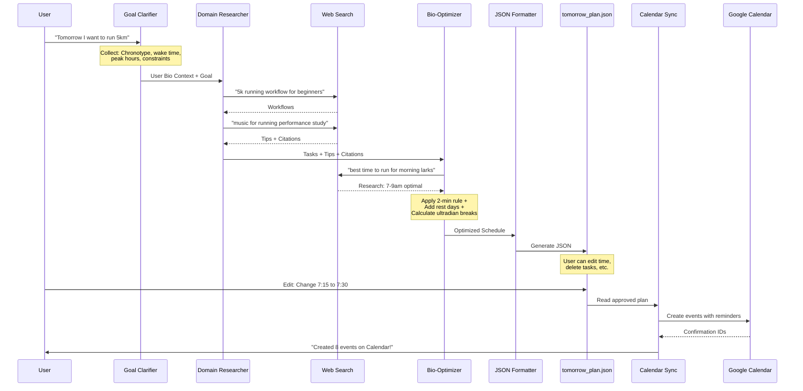

# Atomic Task Planner v2.0 - Technical Specification

> Comprehensive technical documentation for developers and AI coding agents.

---

## Table of Contents

1. [Architecture Overview](#architecture-overview)
2. [Agent Specifications](#agent-specifications)
3. [Data Schemas](#data-schemas)
4. [Code Reference](#code-reference)
5. [Development Guide](#development-guide)

---

## Architecture Overview

### System Architecture

```
┌─────────────────────────────────────────────────────────────────┐
│                        User Interface                           │
│                    (Interactive Terminal)                       │
└─────────────────────────────┬───────────────────────────────────┘
                              │
                              ▼
┌─────────────────────────────────────────────────────────────────┐
│                     AtomicTaskPlanner                           │
│                      (Orchestrator)                             │
│  ┌──────────────┐  ┌──────────────┐  ┌──────────────────────┐  │
│  │ Goal         │  │ Domain       │  │ Bio-Optimizer        │  │
│  │ Clarifier    │→ │ Researcher   │→ │ (A3)                 │  │
│  │ (A1)         │  │ (A2)         │  │ ├─ Atomic Habits     │  │
│  │ ├─ Chat      │  │ ├─ Web Search│  │ ├─ Chronobiology     │  │
│  │ └─ SMART Goal│  │ └─ Evidence  │  │ └─ Rest Management   │  │
│  └──────────────┘  └──────────────┘  └──────────────────────┘  │
│                                                 │               │
│                                                 ▼               │
│                                        ┌──────────────────┐    │
│                                        │ JSON Formatter   │    │
│                                        │ (A4)             │    │
│                                        │ └─ Pure Python   │    │
│                                        └──────────────────┘    │
└─────────────────────────────────────────────────────────────────┘
                              │
                              ▼
┌─────────────────────────────────────────────────────────────────┐
│                    User Review Interface                        │
│              (JSON Editing / External UI)                       │
└─────────────────────────────┬───────────────────────────────────┘
                              │
                              ▼
┌─────────────────────────────────────────────────────────────────┐
│                   Calendar Sync Tool                            │
│              (Standalone - Google Calendar API)                 │
└─────────────────────────────────────────────────────────────────┘
```

### Data Flow



---

## Agent Specifications

### Agent A1: Goal Clarifier

**File**: `agents/goal_clarifier.py`

**Purpose**: Multi-turn conversation to collect biological context and clarify goals.

**Required Information**:
| Field | Description | Example |
|-------|-------------|---------|
| `chronotype` | User's biological clock type | "lark", "owl", "intermediate" |
| `sleep_time` | Usual bedtime | "23:00" |
| `wake_time` | Usual wake time | "07:00" |
| `meal_times` | Breakfast, lunch, dinner times | `{breakfast: "07:30", ...}` |
| `peak_hours` | High energy time windows | `["08:00-10:00", "15:00-17:00"]` |
| `slump_hours` | Low energy time windows | `["13:00-14:00"]` |
| `fixed_commitments` | Unchangeable appointments | `["09:00-10:00: Team meeting"]` |
| `energy_tomorrow` | Predicted energy level | "high", "medium", "low" |
| `physical_constraints` | Health limitations | `["knee pain"]` |

**Output Schema**: `GoalClarifierOutput`

**Key Methods**:
```python
chat(user_input: str, context: Optional[Dict]) -> Dict[str, Any]
generate_goal_spec(user_request: str, bio_context: Dict) -> GoalClarifierOutput
```

---

### Agent A2: Domain Researcher

**File**: `agents/domain_researcher.py`

**Purpose**: Research workflows, tips, and evidence using web search.

**Web Search Queries**:
| Type | Query Pattern |
|------|---------------|
| workflow | `"best workflow for {activity} beginners steps"` |
| tips | `"scientific tips for {activity} performance study"` |
| timing | `"best time of day for {activity} chronotype research"` |
| evidence | `"study evidence benefits of {activity} research"` |

**Output Schema**: `DomainResearcherOutput`

**Key Methods**:
```python
research_domain(goal: str, bio_context: Dict) -> DomainResearcherOutput
_extract_activity(goal: str) -> str
_generate_tasks(goal, activity, workflow_results) -> List[Task]
_generate_tips(activity, tips_results, tasks) -> List[ProTip]
_generate_warnings(goal, activity) -> List[str]
```

---

### Agent A3: Bio-Optimizer

**File**: `agents/bio_optimizer.py`

**Purpose**: Apply Atomic Habits, calculate biological timing, and schedule tasks.

**Atomic Habits Application**:
| Difficulty | Principle | Task Size | Trigger |
|------------|-----------|-----------|---------|
| Low | 2-minute rule | ≤5 min | After morning coffee |
| Medium | Make it obvious | 10-20 min | Scheduled time at desk |
| High | Temptation bundling | 25-50 min | Peak performance window |

**Rest Calculation Rules**:
- **Pomodoro**: 5 min break after 25-30 min focus
- **Ultradian**: 15-20 min break after 90 min focus
- **Meal avoidance**: No focus work ±30 min from meals

**Output Schema**: `BioOptimizerOutput`

**Key Methods**:
```python
optimize_schedule(tasks, tips, bio_profile) -> BioOptimizerOutput
_research_biological_timing(activity, bio_profile) -> Dict
_generate_schedule(tasks, tips, bio_profile, timing_research) -> List[ScheduleItem]
_apply_atomic_habits(task, timing_research) -> Dict
_break_into_atomic_tasks(task, atomic_design, bio_profile) -> List[Dict]
_create_rest_period(end_time, duration, reason, timing_research) -> RestPeriod
```

---

### Agent A4: JSON Formatter

**File**: `agents/json_formatter.py`

**Purpose**: Convert optimized schedule to editable JSON format (Pure Python, no LLM).

**Output File**: `output/tomorrow_plan.json`

**Editable Fields**:
| Field | Can Edit | Description |
|-------|----------|-------------|
| `time` | Yes | Schedule time range |
| `duration` | Yes | Task duration |
| `can_move` | - | Whether time can be changed |
| `can_delete` | - | Whether task can be removed |
| `can_split` | - | Whether task can be split |

**Output Schema**: `FinalPlan`

**Key Methods**:
```python
format_final_plan(optimized_schedule, bio_insights, goal, bio_profile) -> FinalPlan
_convert_to_editable(optimized_schedule) -> Tuple[List[EditableScheduleItem], List[RestPeriodEditable]]
save_to_file(plan, filepath) -> str
generate_summary_markdown(plan) -> str
```

---

## Data Schemas

### Agent 1 Output Schema

```python
class UserBioProfile(BaseModel):
    chronotype: str                    # "lark" | "owl" | "intermediate"
    sleep_time: str                    # "HH:MM"
    wake_time: str                     # "HH:MM"
    meal_times: Dict[str, str]         # {breakfast, lunch, dinner}
    peak_hours: List[str]              # ["HH:MM-HH:MM"]
    slump_hours: List[str]             # ["HH:MM-HH:MM"]
    fixed_commitments: List[str]       # ["HH:MM-HH:MM: Description"]
    energy_tomorrow: str               # "high" | "medium" | "low"
    physical_constraints: List[str]    # ["knee pain", ...]

class GoalClarifierOutput(BaseModel):
    clarified_goal: str                # SMART format goal
    user_bio_profile: UserBioProfile
    conversation_complete: bool
```

### Agent 2 Output Schema

```python
class TaskEvidence(BaseModel):
    source_url: str
    authority: str
    summary: str

class Task(BaseModel):
    task_id: str
    name: str
    description: str
    estimated_duration: str            # ISO 8601 (e.g., "PT30M")
    difficulty: str                    # "high" | "medium" | "low"
    evidence: TaskEvidence

class ProTip(BaseModel):
    tip_id: str
    content: str
    applies_to_task: str               # task_id reference
    evidence: TipEvidence

class DomainResearcherOutput(BaseModel):
    domain: str
    tasks: List[Task]
    pro_tips: List[ProTip]
    warnings: List[str]
```

### Agent 3 Output Schema

```python
class RationaleTiming(BaseModel):
    why_this_time: str
    evidence_url: str
    chronotype_match: str

class AtomicDesign(BaseModel):
    principle: str                     # "2-minute rule" | "make it obvious" | ...
    trigger: str
    friction_reduction: str

class ScheduleItem(BaseModel):
    task_id: str
    original_task_ref: str
    name: str
    description: str
    scheduled_time: str                # "HH:MM-HH:MM"
    rationale_timing: RationaleTiming
    atomic_design: AtomicDesign
    attached_tips: List[str]           # tip_id references
    duration_minutes: int
    type: str                          # "focus" | "rest" | "meal" | "commute"

class BioInsights(BaseModel):
    total_focus_time: str              # e.g., "90 minutes"
    total_rest_time: str               # e.g., "25 minutes"
    energy_curve_match: str            # e.g., "85%"
    warning: str

class BioOptimizerOutput(BaseModel):
    optimized_schedule: List[ScheduleItem]
    bio_insights: BioInsights
```

### Final Plan Schema

```python
class EditableFields(BaseModel):
    time: str
    duration: int
    can_move: bool
    can_delete: bool
    can_split: bool

class EditableScheduleItem(BaseModel):
    id: str
    time: str                          # "HH:MM-HH:MM"
    task: str
    evidence: str
    tips: List[str]
    editable_fields: EditableFields

class RestPeriodEditable(BaseModel):
    time: str
    type: str                          # "mandatory_break"
    rationale: str
    can_remove: bool
    can_extend: bool

class FinalPlan(BaseModel):
    metadata: Metadata
    user_context_summary: UserContextSummary
    editable_schedule: List[EditableScheduleItem]
    rest_periods: List[RestPeriodEditable]
    calendar_ready: bool
```

---

## Code Reference

### Utility Functions

#### Web Search (`utils/web_search.py`)

```python
class WebSearchTool:
    def search(query, max_results=5, include_domains=None, search_depth="advanced") -> Dict
    def search_workflow(activity, task_type="workflow") -> List[Dict]
    def get_reliable_sources() -> List[str]

class MockWebSearchTool:
    """For testing without Tavily API"""
```

#### Validators (`utils/validators.py`)

```python
def validate_plan(plan: Dict) -> Dict[str, Any]
def validate_user_bio_profile(profile: Dict) -> Dict[str, Any]
def validate_time_format(time_str: str) -> bool
def time_to_minutes(time_str: str) -> int
def minutes_to_time(minutes: int) -> str
def check_schedule_conflicts(schedule: List[Dict]) -> List[Dict]
```

### Calendar Sync (`standalone/calendar_sync.py`)

```python
class CalendarSyncTool:
    def __init__(credentials_file, token_file)
    def load_plan(filepath) -> Dict
    def create_events(plan, user_id) -> List[Dict]
    def _create_schedule_event(item, date_str, timezone) -> Dict
    def _create_rest_event(rest, date_str, timezone) -> Dict
    def _get_color_id(item) -> str
    
# Color IDs (Google Calendar)
# 2: Green (easy tasks, ≤2 min)
# 5: Yellow (short tasks, ≤10 min)
# 7: Turquoise (medium tasks, ≤25 min)
# 4: Red (deep work tasks, >25 min)
# 9: Blue (rest periods)
```

---

## Development Guide

### Adding a New Agent

1. Create file in `agents/` directory
2. Define Pydantic schema in `schemas/` directory
3. Implement agent class with standard interface:
   - `__init__`: Initialize LLM and tools
   - Main method: Process input and return structured output
4. Add to `agents/__init__.py`
5. Integrate into `main.py` pipeline

### Modifying Schemas

1. Update Pydantic model in `schemas/`
2. Update agent implementation
3. Update any downstream consumers
4. Run individual test files:
```bash
python tests/test_goal_clarifier.py
python tests/test_domain_researcher.py
python tests/test_bio_optimizer.py
python tests/test_json_formatter.py
python tests/test_validators.py
```

### Testing

```bash
# Test all imports and schemas
python test_system.py

# Test individual agent
python -c "from agents.goal_clarifier import GoalClarifierAgent; print('OK')"

# Test with mock search
# Set USE_MOCK_SEARCH=True in .env
python main.py
```

### Environment Variables

```env
# Required
GOOGLE_API_KEY=your_google_api_key_here

# Optional
TAVILY_API_KEY=your_tavily_api_key_here
USE_MOCK_SEARCH=False
GEMINI_MODEL=gemini-2.5-flash-lite
```

---

## Troubleshooting

### Common Issues

| Issue | Solution |
|-------|----------|
| "GOOGLE_API_KEY not found" | Check `.env` file exists and contains valid key |
| "TAVILY_API_KEY not found" | Set `USE_MOCK_SEARCH=True` in `.env` for testing |
| Module import errors | Ensure virtual environment activated, run `pip install -r requirements.txt` |
| Google Calendar auth fails | Ensure `credentials.json` exists, delete `token.json` to re-authenticate |
| No events created | Check `calendar_ready: true` in JSON, use `--dry-run` to test |

---

## References

- **Atomic Habits**: James Clear's framework for habit formation
- **Chronobiology**: Study of biological rhythms and optimal timing
- **Pomodoro Technique**: Time management method (25 min work + 5 min break)
- **Ultradian Rhythms**: 90-120 minute cycles in human alertness

---

*Last Updated: 2026-02-02*  
*Version: 2.0*  
*Project: Atomic Task Planner*
